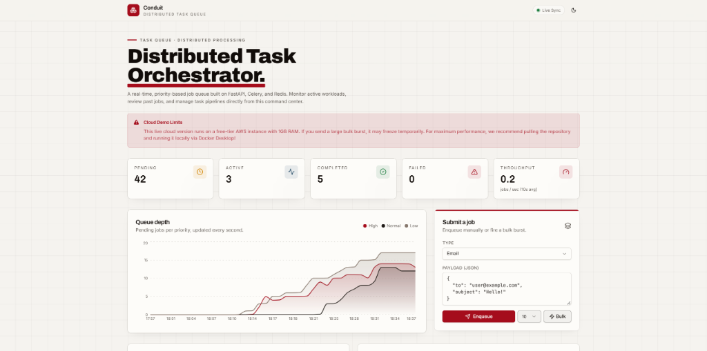
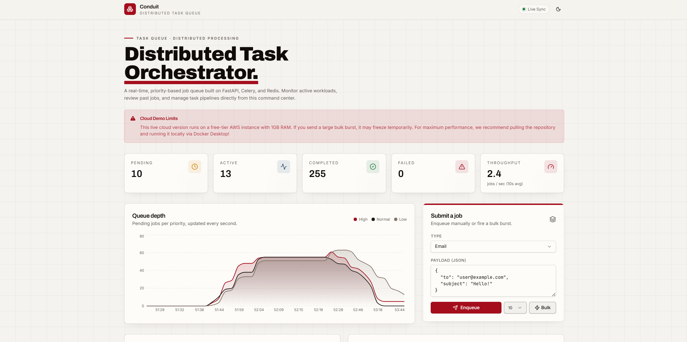
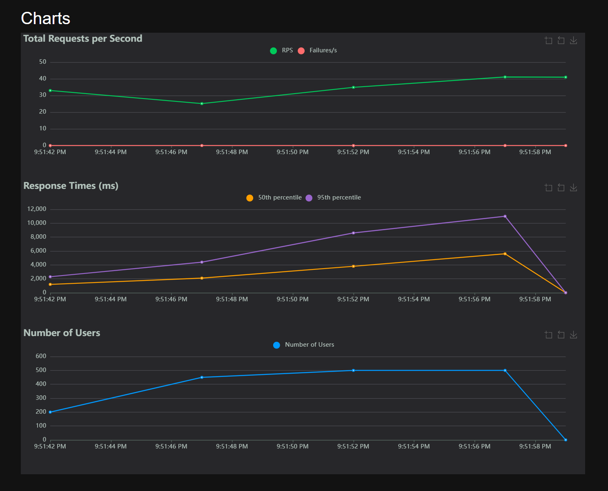
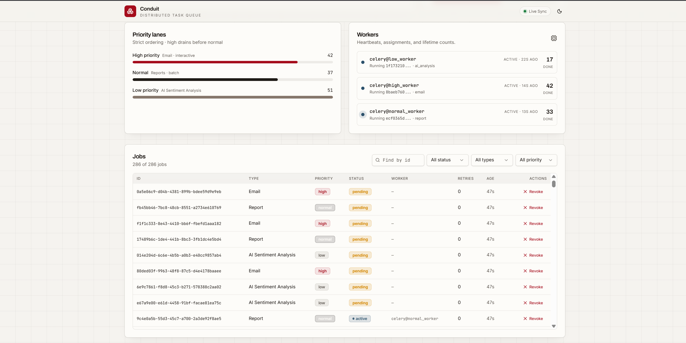
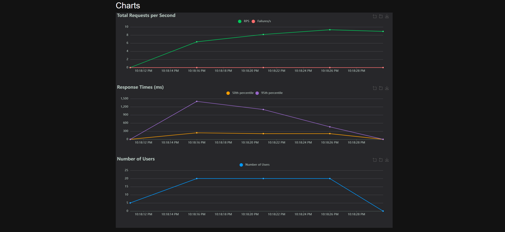
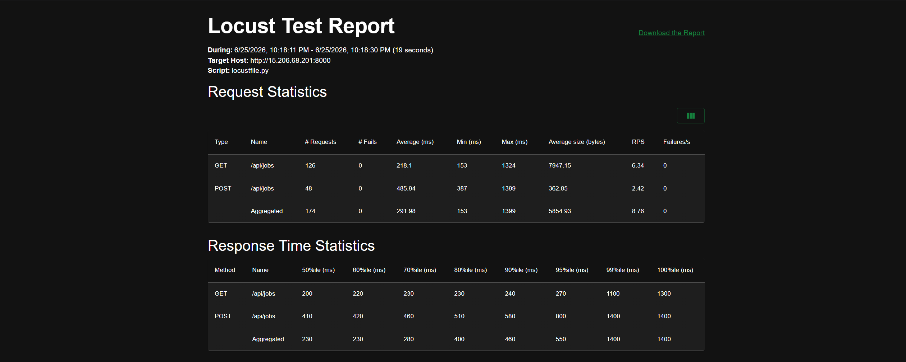

# Conduit: Distributed Task Queue 🚀

A real-time, highly-resilient, priority-based distributed task orchestrator. 

       

Conduit is a production-ready demonstration of distributed background processing. Instead of blocking the main API thread with long-running tasks, the server immediately acknowledges the request and pushes the task to a Redis message broker. Background Celery workers then pick up these tasks based on strict priority routing.



---

## 📋 Table of Contents

- [Overview](#-overview)
- [System Architecture](#-system-architecture)
- [Infrastructure & Dockerfiles](#-infrastructure--dockerfiles)
- [CI/CD Pipeline (GitHub Actions)](#-cicd-pipeline)
- [Features & Chaos Engineering](#-features--chaos-engineering)
- [Load Testing: Local vs Cloud](#-load-testing-local-vs-cloud)
- [How to Run Locally](#-how-to-run-locally)
- [How to Run on Cloud](#-how-to-run-on-cloud)

---

## 🎯 Overview

Conduit demonstrates how to decouple heavy workloads from your main web server. By using a message broker (Redis) and distributed workers (Celery), Conduit guarantees that the user-facing API remains lightning fast, even when processing hundreds of simultaneous background jobs like Email Sending, Report Generation, and AI Sentiment Analysis.

---

## 🏗️ System Architecture

```text
+-----------------------------------------------------------------------------+
|                                 CLIENT LAYER                                |
|                   React 18 + Vite + Tailwind CSS (Vercel)                   |
|                        Real-time UI Polling & Rendering                     |
+---------------------------------------+-------------------------------------+
                                        | HTTP / REST API
                                        v
+-----------------------------------------------------------------------------+
|                                  API LAYER                                  |
|         FastAPI (ASGI) + Python 3.11 + Uvicorn (AWS EC2 / Render)           |
|                Asynchronous Endpoints, Pydantic Validation                  |
+-------------------+---------------------------------------+-----------------+
                    | Insert Job (Pending)                  | Push Task to Queue
                    v                                       v
+-----------------------------------+       +---------------------------------+
|          DATABASE LAYER           |       |          BROKER LAYER           |
|     PostgreSQL (Neon/Supabase)    |       |         Redis (Upstash)         |
|  Stores Job States & Worker Sync  |       |    Message Queues (Low, High)   |
+-----------------------------------+       +---------------------------------+
                    ^                                       |
                    | Update Status (Started/Success)       | Pop Task from Queue
                    |                                       v
+-------------------+---------------------------------------+-----------------+
|                                WORKER LAYER                                 |
|            Celery Distributed Workers (Multiple Docker Containers)          |
|    +-------------------+   +--------------------+   +-------------------+   |
|    | celery@low_worker |   | celery@normal_wrkr |   | celery@high_wrkr  |   |
|    | (AI Sentiment)    |   | (Reports)          |   | (Emails)          |   |
|    +-------------------+   +--------------------+   +-------------------+   |
+-----------------------------------------------------------------------------+
```

---

## 🐳 Infrastructure & Dockerfiles

The entire backend ecosystem is containerized for seamless local development and cloud deployment. 

### `Dockerfile.api`
Builds the FastAPI application.
- Utilizes `python:3.11-slim` for a tiny image footprint.
- Runs via `uvicorn` mapping to port 8000.
- Implements strict `.dockerignore` rules to prevent local `__pycache__` and `venv` corruption during the BuildKit cache phase.

### `Dockerfile.worker`
Builds the Celery Worker instances.
- Shares the same base code as the API but changes the entrypoint.
- Uses `celery -A src.worker worker` to initialize the task processing daemon.
- Configured dynamically via `docker-compose` environment variables to listen only to specific queues (e.g., `-Q high_priority`).

### `docker-compose.yml`
Orchestrates the local environment:
- **`api`**: The FastAPI backend.
- **`worker_high`**: A dedicated Celery container listening ONLY to the `high_priority` queue.
- **`worker_normal`**: Listens to the `normal_priority` queue.
- **`worker_low`**: Listens to the `low_priority` queue.
- Includes Redis and Postgres containers for zero-dependency local testing.

---

## 🚀 CI/CD Pipeline

Conduit utilizes **GitHub Actions** for continuous integration and continuous deployment (CI/CD).

1. **Test Phase (`pytest`)**: Automatically runs the Python test suite to ensure no breaking changes are pushed to `main`.
2. **Build Phase (`docker build`)**: Uses Docker BuildKit to construct the new `distributedtaskqueue-api` and `distributedtaskqueue-worker` images.
3. **Deploy Phase (AWS EC2)**:
   - SSH's into the AWS EC2 instance.
   - Pulls the newly built images from the container registry.
   - Executes a zero-downtime `docker compose up -d --build` to safely swap the running containers.
   - Vercel automatically detects pushes to `main` and redeploys the React frontend globally via their Edge Network.

---

## 🔥 Features & Chaos Engineering

### Strict Priority Lanes
Jobs are strictly routed based on their type. 
- **Email**: `High Priority` - Drains immediately.
- **Reports**: `Normal Priority` - Processed in standard batches.
- **AI Analysis**: `Low Priority` - Background tasks that can wait.

### Chaos Engineering & Resilience
We intentionally programmed the Celery workers with a **10% simulated failure rate**.
```python
if random.random() < 0.10:
    raise RuntimeError("Chaos Engineering : Random simulated failure")
```
This proves that the system is unbreakable. When a worker randomly crashes or drops a database connection, the Celery `max_retries=3` system safely catches the error, pauses for 5 seconds, and automatically requeues the job without losing any user data.

### Database Connection Scaling
To handle massive bursts of simultaneous load (500+ requests per second), the SQLAlchemy `create_async_engine` is heavily customized:
- `pool_size=100`: Allows 100 concurrent DB connections.
- `max_overflow=200`: Allows bursting up to 300 connections to prevent `TimeoutError` when Locust attacks the server.

---

## 🏎️ Load Testing: Local vs Cloud

We aggressively stress-tested this architecture using **Locust**, generating hundreds of requests per second.

### 💻 Local Machine (High Performance)
Tested on a powerful local machine. The queue easily absorbed a burst of **500 concurrent users** maintaining 35-40 RPS. The system seamlessly distributed the jobs across all 3 priority workers with zero dropped requests.

**Workers Processing Live Data:**


**Locust Charts (Zero Failures):**


**Dashboard Active Queue:**



### ☁️ Cloud Deployment (AWS Free Tier)
Deployed to a tiny **t2.micro AWS EC2 instance (1GB RAM)**. Instead of freezing or crashing the server, the queue flawlessly absorbed the traffic and trickled it through the Celery workers. The Locust charts show a 100% success rate with 0 failures, proving that task queues allow tiny servers to process massive traffic bursts safely!

**Cloud Locust Charts:**


**Cloud Test Report:**


---

## 🛠️ How to Run Locally

You can spin up the entire distributed system (Frontend, API, 3 Workers, Redis, and Postgres) with a single Docker command!

1. Clone this repository and navigate into the root folder:
   ```bash
   git clone https://github.com/saumyashah0510/distributed-task-queue.git
   cd "Distributed task queue"
   ```

2. Spin up the entire microservice architecture:
   ```bash
   docker compose up -d --build
   ```

3. Open the beautiful Command Center Dashboard:
   - Navigate to `http://localhost:5173` in your browser.

4. Unleash the Load Test!
   ```bash
   cd backend
   pip install -r requirements.txt
   locust -f load_tests/locustfile.py
   ```
   - Open `http://localhost:8089`, set Users to 500, Spawn Rate to 50, and watch the queue fill up!

---

## ☁️ How to Run on Cloud (AWS + Vercel)

### 1. Database & Broker
- Spin up a free managed Postgres database (e.g., Supabase or Neon).
- Spin up a free managed Redis instance (e.g., Upstash).

### 2. Backend (AWS EC2 / Render)
Deploy the backend containers to a cloud provider using the provided `docker-compose.prod.yml`:
```bash
docker compose -f docker-compose.prod.yml up -d --build
```
Ensure you provide your `.env` variables containing your `DATABASE_URL` and `REDIS_URL`.

### 3. Frontend (Vercel)
Deploy the `frontend/` directory to Vercel. 
In your Vercel Project Settings, add the Environment Variable:
`VITE_API_URL = http://<your-aws-ec2-ip>:8000`
